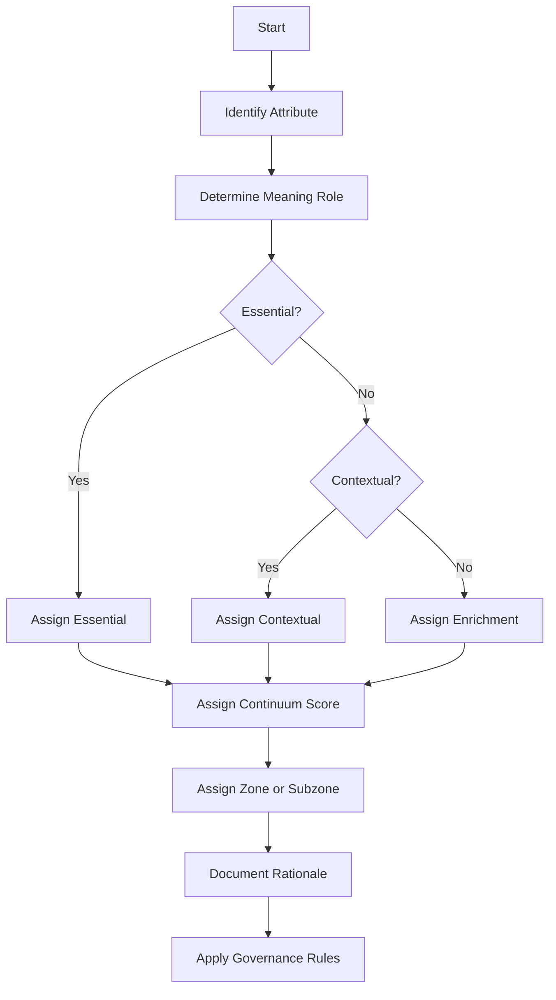

```mermaid
flowchart TD
    A[Start] --> B[Identify Attribute]
    B --> C[Determine Meaning Role]
    C --> D{Essential?}
    D -->|Yes| E[Assign Essential]
    D -->|No| F{Contextual?}
    F -->|Yes| G[Assign Contextual]
    F -->|No| H[Assign Enrichment]

    E --> I[Assign Continuum Score]
    G --> I
    H --> I

    I --> J[Assign Zone or Subzone]
    J --> K[Document Rationale]
    K --> L[Apply Governance Rules]
```
