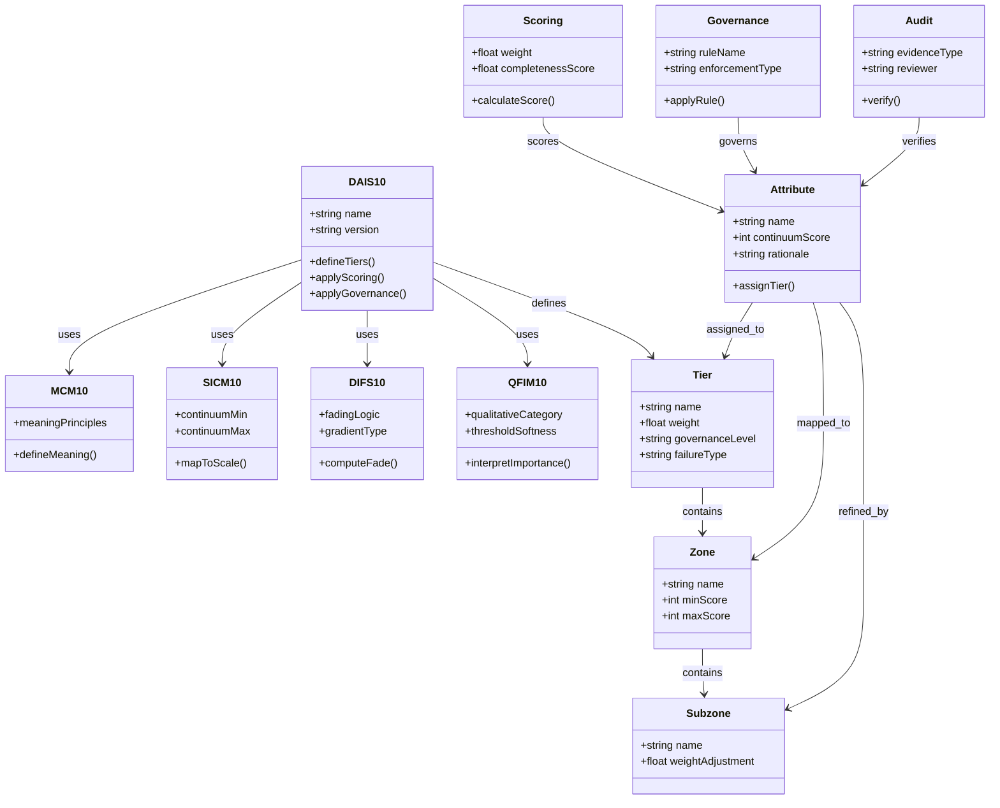

```mermaid
classDiagram

    %% Core Standard
    class DAIS10 {
        +string name
        +string version
        +defineTiers()
        +applyScoring()
        +applyGovernance()
    }

    %% Engines
    class MCM10 {
        +meaningPrinciples
        +defineMeaning()
    }

    class SICM10 {
        +continuumMin
        +continuumMax
        +mapToScale()
    }

    class DIFS10 {
        +fadingLogic
        +gradientType
        +computeFade()
    }

    class QFIM10 {
        +qualitativeCategory
        +thresholdSoftness
        +interpretImportance()
    }

    %% Tiering
    class Tier {
        +string name
        +float weight
        +string governanceLevel
        +string failureType
    }

    class Zone {
        +string name
        +int minScore
        +int maxScore
    }

    class Subzone {
        +string name
        +float weightAdjustment
    }

    %% Attributes
    class Attribute {
        +string name
        +int continuumScore
        +string rationale
        +assignTier()
    }

    %% Scoring
    class Scoring {
        +float weight
        +float completenessScore
        +calculateScore()
    }

    %% Governance
    class Governance {
        +string ruleName
        +string enforcementType
        +applyRule()
    }

    %% Audit
    class Audit {
        +string evidenceType
        +string reviewer
        +verify()
    }

    %% Relationships
    DAIS10 --> MCM10 : uses
    DAIS10 --> SICM10 : uses
    DAIS10 --> DIFS10 : uses
    DAIS10 --> QFIM10 : uses

    DAIS10 --> Tier : defines
    Tier --> Zone : contains
    Zone --> Subzone : contains

    Attribute --> Tier : assigned_to
    Attribute --> Zone : mapped_to
    Attribute --> Subzone : refined_by

    Scoring --> Attribute : scores
    Governance --> Attribute : governs
    Audit --> Attribute : verifies
```
