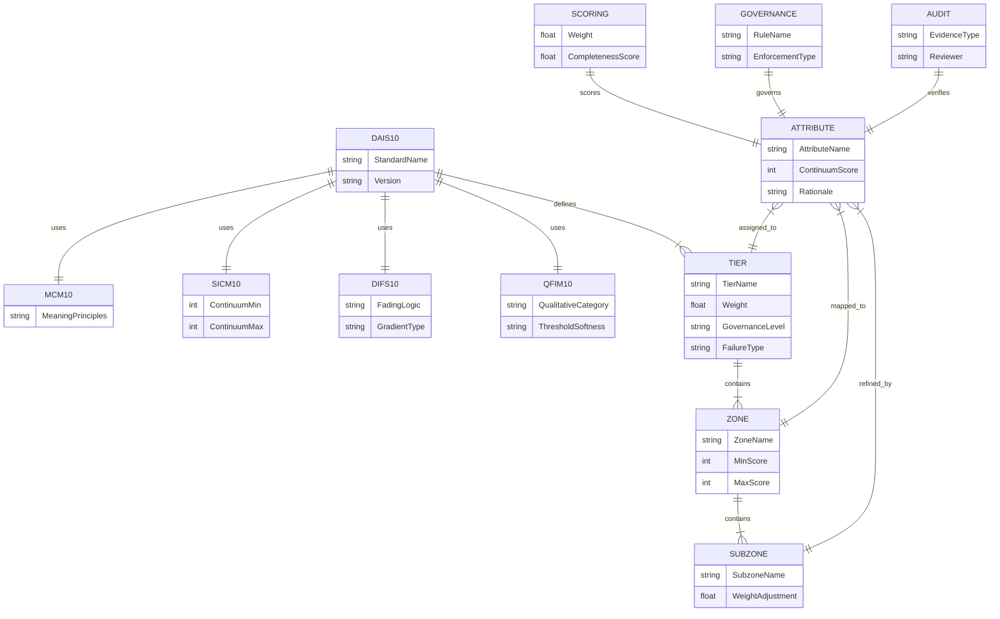

```mermaid
erDiagram

    %% Core Standard
    DAIS10 {
        string StandardName
        string Version
    }

    %% Engines
    MCM10 {
        string MeaningPrinciples
    }

    SICM10 {
        int ContinuumMin
        int ContinuumMax
    }

    DIFS10 {
        string FadingLogic
        string GradientType
    }

    QFIM10 {
        string QualitativeCategory
        string ThresholdSoftness
    }

    %% Tiering
    TIER {
        string TierName
        float Weight
        string GovernanceLevel
        string FailureType
    }

    ZONE {
        string ZoneName
        int MinScore
        int MaxScore
    }

    SUBZONE {
        string SubzoneName
        float WeightAdjustment
    }

    ATTRIBUTE {
        string AttributeName
        int ContinuumScore
        string Rationale
    }

    %% Scoring
    SCORING {
        float Weight
        float CompletenessScore
    }

    %% Governance
    GOVERNANCE {
        string RuleName
        string EnforcementType
    }

    %% Audit
    AUDIT {
        string EvidenceType
        string Reviewer
    }

    %% Relationships
    DAIS10 ||--|| MCM10 : uses
    DAIS10 ||--|| SICM10 : uses
    DAIS10 ||--|| DIFS10 : uses
    DAIS10 ||--|| QFIM10 : uses

    DAIS10 ||--|{ TIER : defines
    TIER ||--|{ ZONE : contains
    ZONE ||--|{ SUBZONE : contains

    ATTRIBUTE }|--|| TIER : assigned_to
    ATTRIBUTE }|--|| ZONE : mapped_to
    ATTRIBUTE }|--|| SUBZONE : refined_by

    SCORING ||--|| ATTRIBUTE : scores
    GOVERNANCE ||--|| ATTRIBUTE : governs
    AUDIT ||--|| ATTRIBUTE : verifies
```
