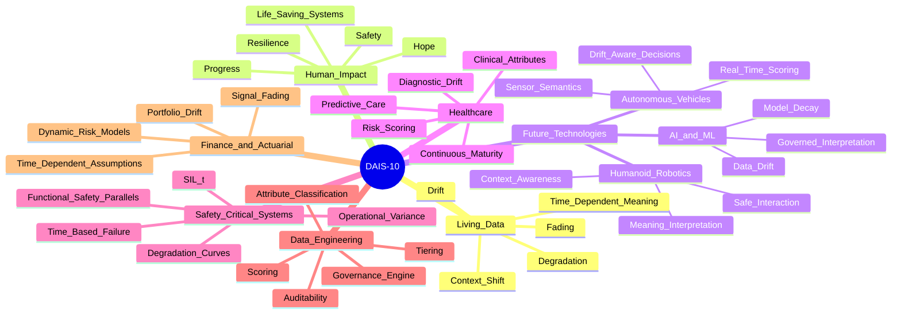

********************************************************************************************************************

```mermaid
mindmap
  root((DAIS‑10))

    Living_Data
      Drift
      Fading
      Degradation
      Context_Shift
      Time_Dependent_Meaning

    Human_Impact
      Hope
      Progress
      Safety
      Resilience
      Life_Saving_Systems

    Future_Technologies
      Autonomous_Vehicles
        Sensor_Semantics
        Real_Time_Scoring
        Drift_Aware_Decisions
      Humanoid_Robotics
        Meaning_Interpretation
        Safe_Interaction
        Context_Awareness
      AI_and_ML
        Data_Drift
        Model_Decay
        Governed_Interpretation

    Healthcare
      Clinical_Attributes
      Diagnostic_Drift
      Risk_Scoring
      Predictive_Care
      Continuous_Maturity

    Safety_Critical_Systems
      SIL_t
      Time_Based_Failure
      Degradation_Curves
      Operational_Variance
      Functional_Safety_Parallels

    Data_Engineering
      Attribute_Classification
      Tiering
      Scoring
      Governance_Engine
      Auditability

    Finance_and_Actuarial
      Signal_Fading
      Portfolio_Drift
      Dynamic_Risk_Models
      Time_Dependent_Assumptions
```
