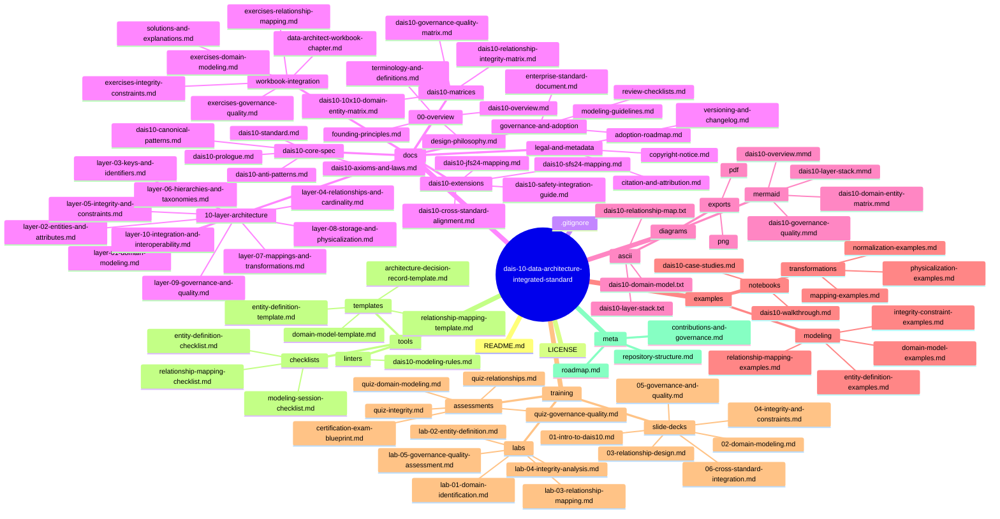
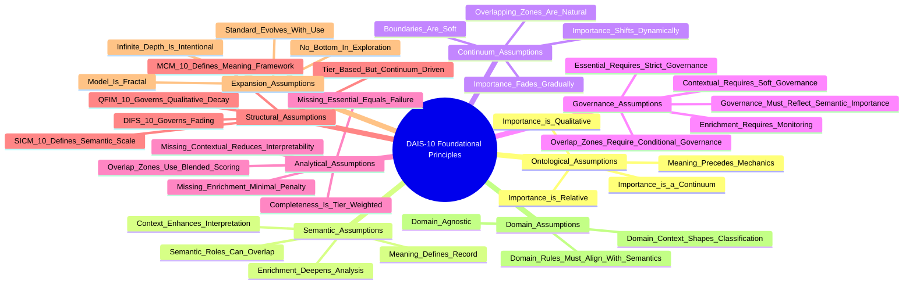

```mermaid

mindmap
  root((dais-10-data-architecture-integrated-standard))
    README.md
    LICENSE
    .gitignore

    docs
      00-overview
        dais10-overview.md
        terminology-and-definitions.md
        founding-principles.md
        design-philosophy.md

      10-layer-architecture
        layer-01-domain-modeling.md
        layer-02-entities-and-attributes.md
        layer-03-keys-and-identifiers.md
        layer-04-relationships-and-cardinality.md
        layer-05-integrity-and-constraints.md
        layer-06-hierarchies-and-taxonomies.md
        layer-07-mappings-and-transformations.md
        layer-08-storage-and-physicalization.md
        layer-09-governance-and-quality.md
        layer-10-integration-and-interoperability.md

      dais10-core-spec
        dais10-standard.md
        dais10-prologue.md
        dais10-axioms-and-laws.md
        dais10-canonical-patterns.md
        dais10-anti-patterns.md

      dais10-matrices
        dais10-10x10-domain-entity-matrix.md
        dais10-relationship-integrity-matrix.md
        dais10-governance-quality-matrix.md

      dais10-extensions
        dais10-sfs24-mapping.md
        dais10-jfs24-mapping.md
        dais10-safety-integration-guide.md
        dais10-cross-standard-alignment.md

      workbook-integration
        data-architect-workbook-chapter.md
        exercises-domain-modeling.md
        exercises-relationship-mapping.md
        exercises-integrity-constraints.md
        exercises-governance-quality.md
        solutions-and-explanations.md

      governance-and-adoption
        enterprise-standard-document.md
        modeling-guidelines.md
        review-checklists.md
        adoption-roadmap.md

      legal-and-metadata
        copyright-notice.md
        versioning-and-changelog.md
        citation-and-attribution.md

    diagrams
      ascii
        dais10-layer-stack.txt
        dais10-domain-model.txt
        dais10-relationship-map.txt
      mermaid
        dais10-overview.mmd
        dais10-layer-stack.mmd
        dais10-domain-entity-matrix.mmd
        dais10-governance-quality.mmd
      exports
        png
        pdf

    examples
      modeling
        domain-model-examples.md
        entity-definition-examples.md
        relationship-mapping-examples.md
        integrity-constraint-examples.md
      transformations
        mapping-examples.md
        normalization-examples.md
        physicalization-examples.md
      notebooks
        dais10-walkthrough.md
        dais10-case-studies.md

    training
      slide-decks
        01-intro-to-dais10.md
        02-domain-modeling.md
        03-relationship-design.md
        04-integrity-and-constraints.md
        05-governance-and-quality.md
        06-cross-standard-integration.md
      labs
        lab-01-domain-identification.md
        lab-02-entity-definition.md
        lab-03-relationship-mapping.md
        lab-04-integrity-analysis.md
        lab-05-governance-quality-assessment.md
      assessments
        quiz-domain-modeling.md
        quiz-relationships.md
        quiz-integrity.md
        quiz-governance-quality.md
        certification-exam-blueprint.md

    tools
      linters
        dais10-modeling-rules.md
      checklists
        modeling-session-checklist.md
        entity-definition-checklist.md
        relationship-mapping-checklist.md
      templates
        architecture-decision-record-template.md
        domain-model-template.md
        entity-definition-template.md
        relationship-mapping-template.md

    meta
      roadmap.md
      repository-structure.md
      contributions-and-governance.md
```

```mermaid

mindmap
  root((DAIS‑10 Foundational Principles))

    Ontological_Assumptions
      Importance_is_Qualitative
      Importance_is_a_Continuum
      Importance_is_Relative
      Meaning_Precedes_Mechanics

    Semantic_Assumptions
      Meaning_Defines_Record
      Context_Enhances_Interpretation
      Enrichment_Deepens_Analysis
      Semantic_Roles_Can_Overlap

    Continuum_Assumptions
      Importance_Fades_Gradually
      Overlapping_Zones_Are_Natural
      Boundaries_Are_Soft
      Importance_Shifts_Dynamically

    Governance_Assumptions
      Essential_Requires_Strict_Governance
      Contextual_Requires_Soft_Governance
      Enrichment_Requires_Monitoring
      Overlap_Zones_Require_Conditional_Governance
      Governance_Must_Reflect_Semantic_Importance

    Analytical_Assumptions
      Completeness_Is_Tier_Weighted
      Missing_Essential_Equals_Failure
      Missing_Contextual_Reduces_Interpretability
      Missing_Enrichment_Minimal_Penalty
      Overlap_Zones_Use_Blended_Scoring

    Structural_Assumptions
      Tier_Based_But_Continuum_Driven
      DIFS_10_Governs_Fading
      QFIM_10_Governs_Qualitative_Decay
      SICM_10_Defines_Semantic_Scale
      MCM_10_Defines_Meaning_Framework

    Expansion_Assumptions
      Model_Is_Fractal
      No_Bottom_In_Exploration
      Standard_Evolves_With_Use
      Infinite_Depth_Is_Intentional

    Domain_Assumptions
      Domain_Agnostic
      Domain_Context_Shapes_Classification
      Domain_Rules_Must_Align_With_Semantics
```
