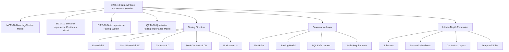

```mermaid
flowchart TD
    A[DAIS-10 Data Attribute Importance Standard]

    A --> B[MCM-10 Meaning-Centric Model]
    A --> C[SICM-10 Semantic Importance Continuum Model]
    A --> D[DIFS-10 Data Importance Fading System]
    A --> E[QFIM-10 Qualitative Fading Importance Model]

    A --> F[Tiering Structure]
    F --> F1[Essential E]
    F --> F2[Semi-Essential EC]
    F --> F3[Contextual C]
    F --> F4[Semi-Contextual CN]
    F --> F5[Enrichment N]

    A --> G[Governance Layer]
    G --> G1[Tier Rules]
    G --> G2[Scoring Model]
    G --> G3[SQL Enforcement]
    G --> G4[Audit Requirements]

    A --> H[Infinite-Depth Expansion]
    H --> H1[Subzones]
    H --> H2[Semantic Gradients]
    H --> H3[Contextual Layers]
    H --> H4[Temporal Shifts]
```
