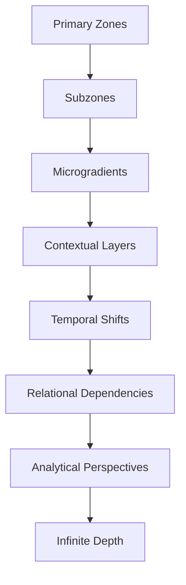

```mermaid
flowchart TD
    A[Primary Zones] --> B[Subzones]
    B --> C[Microgradients]
    C --> D[Contextual Layers]
    D --> E[Temporal Shifts]
    E --> F[Relational Dependencies]
    F --> G[Analytical Perspectives]
    G --> H[Infinite Depth]
```
