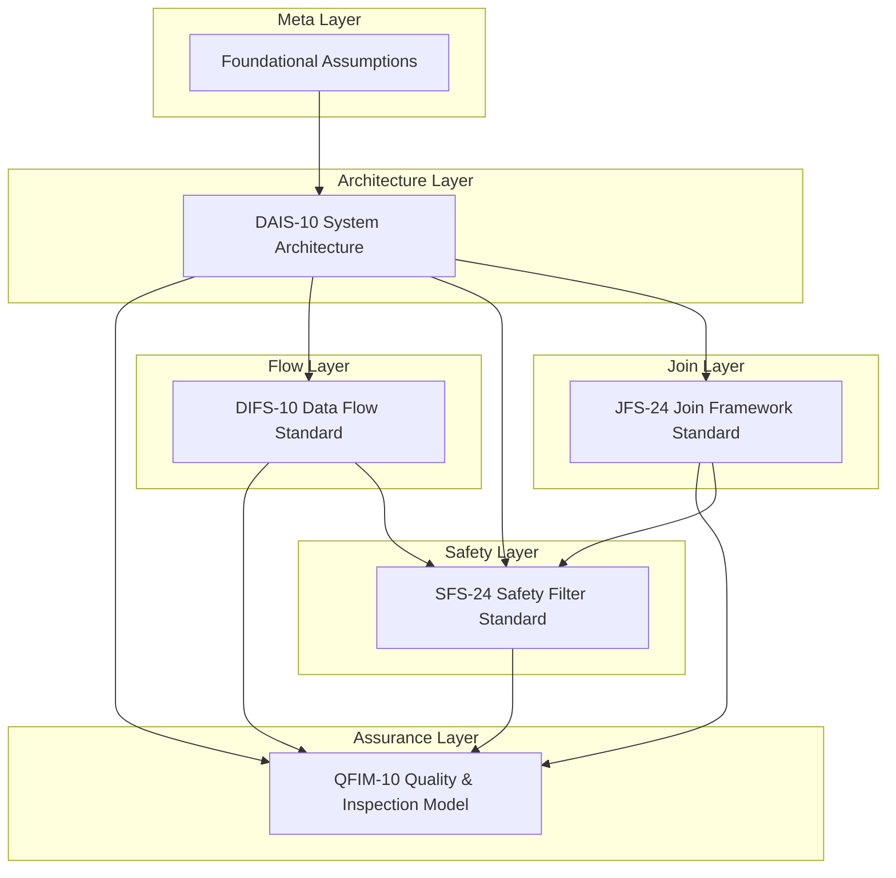
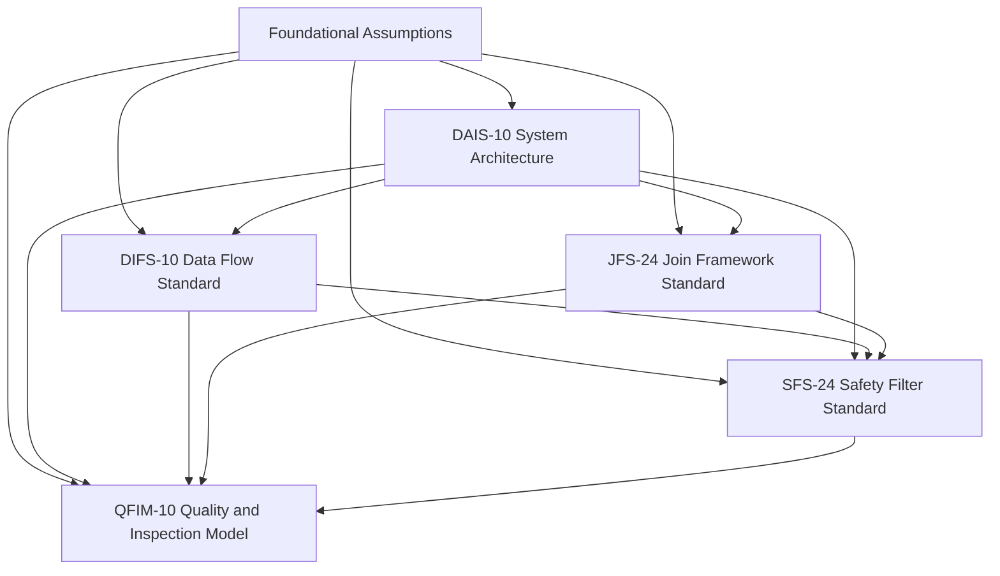
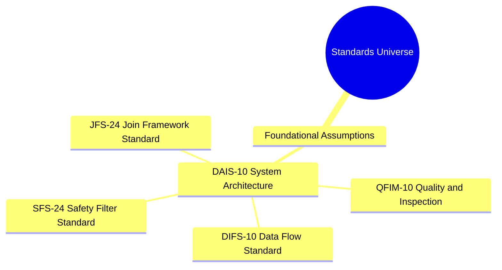
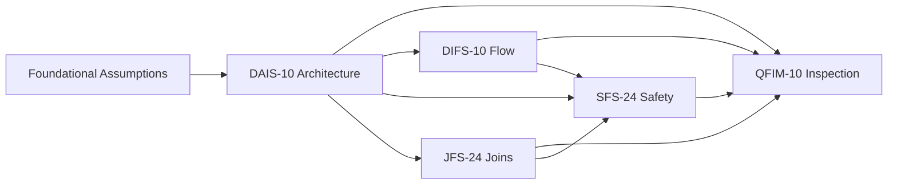
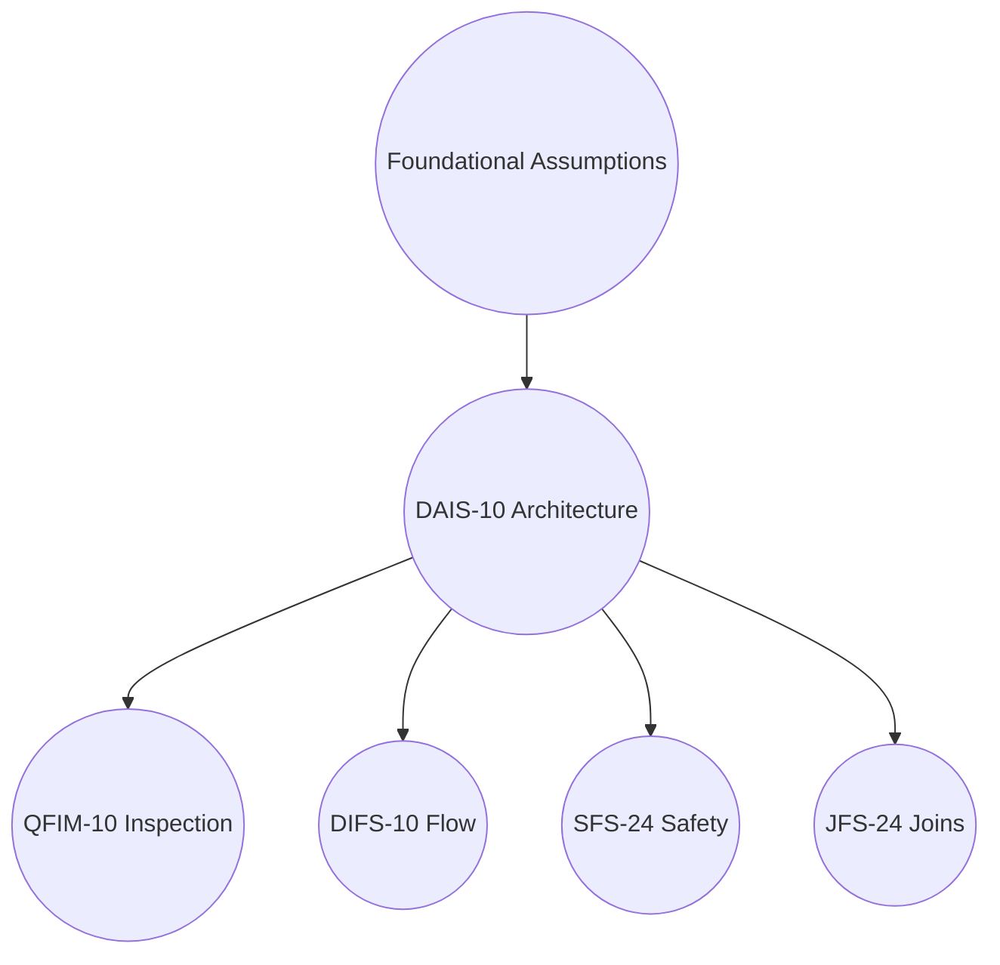
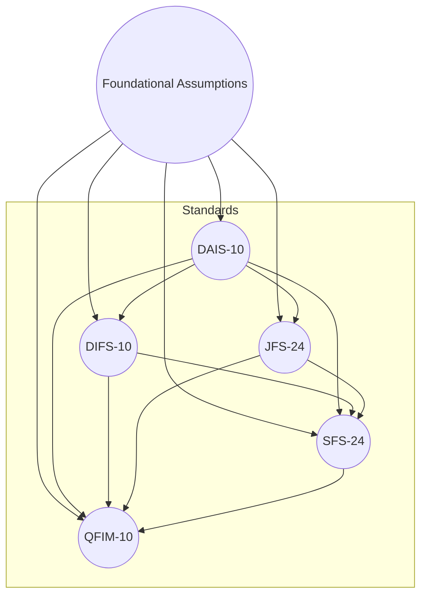

Layered Architecture Diagram 

Option 2 — Mindmap (Executive‑level clarity)

Option 3 — Left‑to‑Right Architecture (More modern, more readable)

Option 4 — Onion Model (Most professional for standards)

Option 5 — Standards Universe Map (Most visually impressive)

