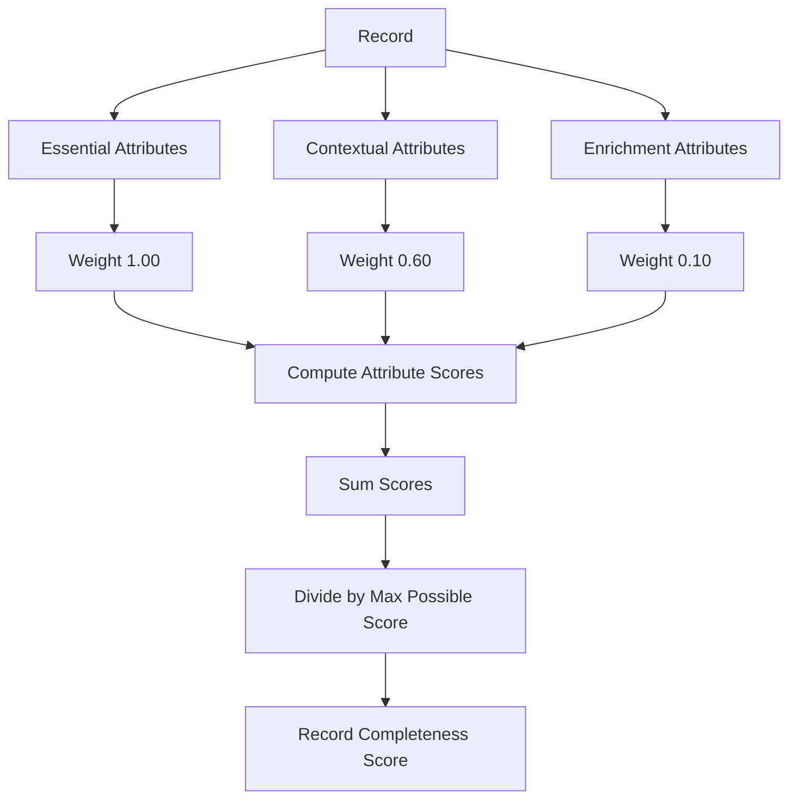

```mermaid
flowchart TD
    A[Record] --> B[Essential Attributes]
    A --> C[Contextual Attributes]
    A --> D[Enrichment Attributes]

    B --> B1[Weight 1.00]
    C --> C1[Weight 0.60]
    D --> D1[Weight 0.10]

    B1 --> E[Compute Attribute Scores]
    C1 --> E
    D1 --> E

    E --> F[Sum Scores]
    F --> G[Divide by Max Possible Score]
    G --> H[Record Completeness Score]
```
