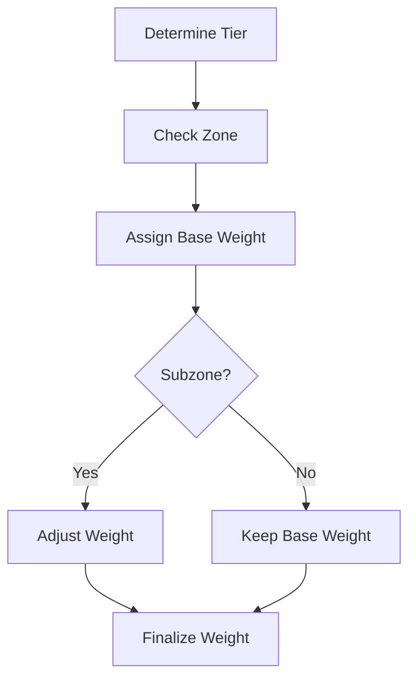

```mermaid
flowchart TD
    A[Determine Tier] --> B[Check Zone]
    B --> C[Assign Base Weight]
    C --> D{Subzone?}
    D -->|Yes| E[Adjust Weight]
    D -->|No| F[Keep Base Weight]

    E --> G[Finalize Weight]
    F --> G
```
