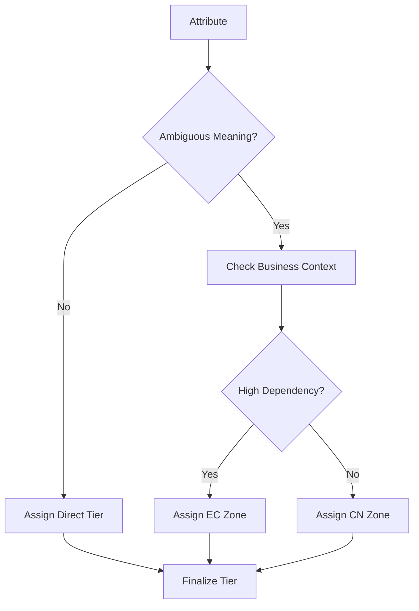

```mermaid
flowchart TD
    A[Attribute] --> B{Ambiguous Meaning?}

    B -->|Yes| C[Check Business Context]
    B -->|No| D[Assign Direct Tier]

    C --> E{High Dependency?}
    E -->|Yes| F[Assign EC Zone]
    E -->|No| G[Assign CN Zone]

    D --> H[Finalize Tier]
    F --> H
    G --> H
```
