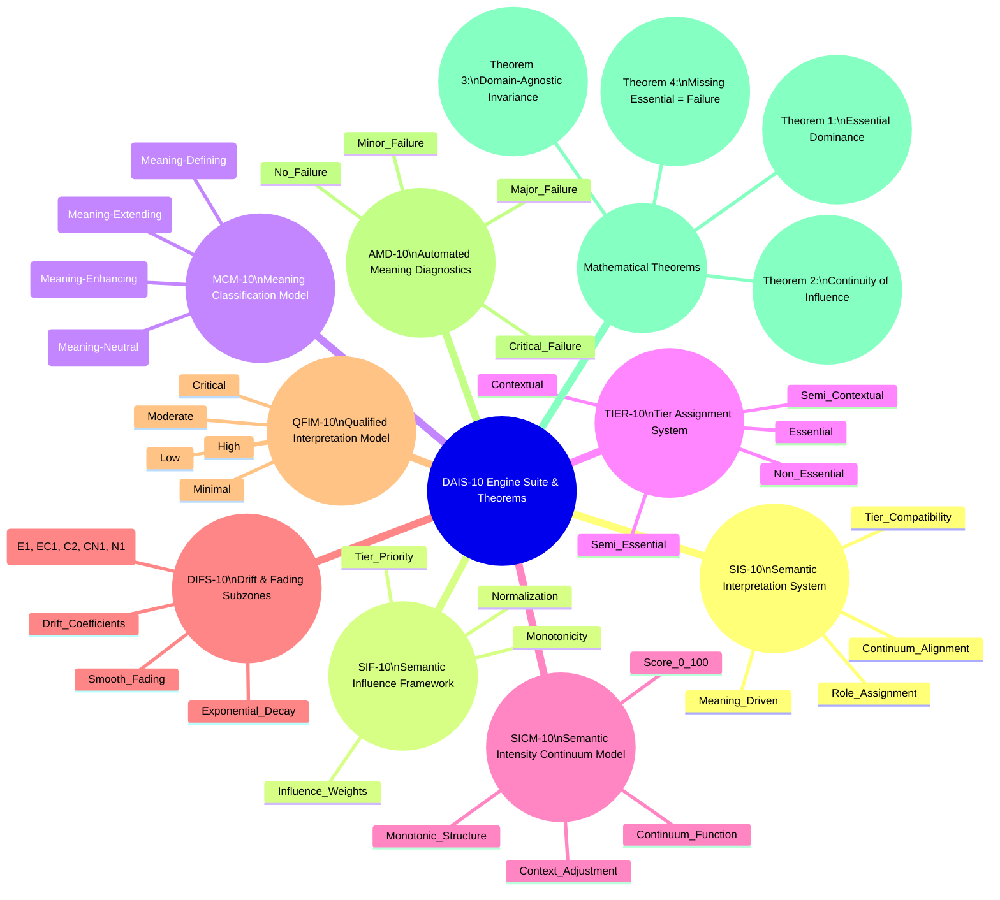

```mermaid
mindmap
  root((DAIS‑10 Engine Suite & Theorems))

    SIS_10((SIS‑10\nSemantic Interpretation System))
      Meaning_Driven
      Role_Assignment
      Tier_Compatibility
      Continuum_Alignment

    SIF_10((SIF‑10\nSemantic Influence Framework))
      Influence_Weights
      Normalization
      Monotonicity
      Tier_Priority

    MCM_10((MCM‑10\nMeaning Classification Model))
      MD(Meaning‑Defining)
      ME(Meaning‑Enhancing)
      MX(Meaning‑Extending)
      MN(Meaning‑Neutral)

    TIER_10((TIER‑10\nTier Assignment System))
      Essential
      Semi_Essential
      Contextual
      Semi_Contextual
      Non_Essential

    SICM_10((SICM‑10\nSemantic Intensity Continuum Model))
      Score_0_100
      Continuum_Function
      Context_Adjustment
      Monotonic_Structure

    DIFS_10((DIFS‑10\nDrift & Fading Subzones))
      Exponential_Decay
      Drift_Coefficients
      Subzones(E1, EC1, C2, CN1, N1)
      Smooth_Fading

    QFIM_10((QFIM‑10\nQualified Interpretation Model))
      Critical
      High
      Moderate
      Low
      Minimal

    AMD_10((AMD‑10\nAutomated Meaning Diagnostics))
      Critical_Failure
      Major_Failure
      Minor_Failure
      No_Failure

    Theorems((Mathematical Theorems))
      Tier_Dominance((Theorem 1:\nEssential Dominance))
      Continuity((Theorem 2:\nContinuity of Influence))
      Domain_Invariance((Theorem 3:\nDomain‑Agnostic Invariance))
      Semantic_Collapse((Theorem 4:\nMissing Essential = Failure))
```
