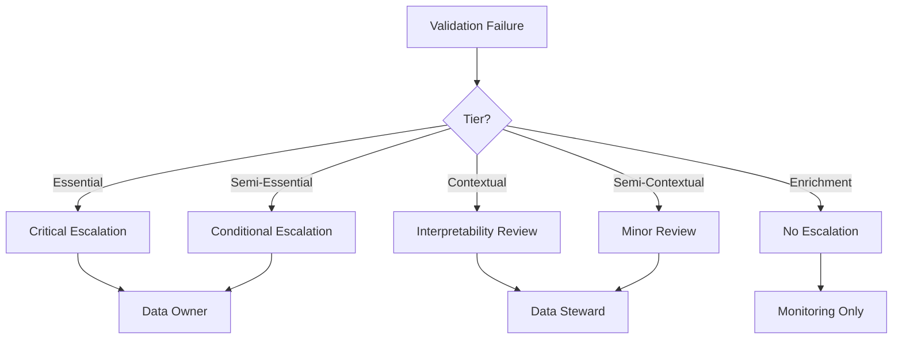

```mermaid
flowchart TD
    A[Validation Failure] --> B{Tier?}

    B -->|Essential| C[Critical Escalation]
    B -->|Semi-Essential| D[Conditional Escalation]
    B -->|Contextual| E[Interpretability Review]
    B -->|Semi-Contextual| F[Minor Review]
    B -->|Enrichment| G[No Escalation]

    C --> H[Data Owner]
    D --> H
    E --> I[Data Steward]
    F --> I
    G --> J[Monitoring Only]
```
