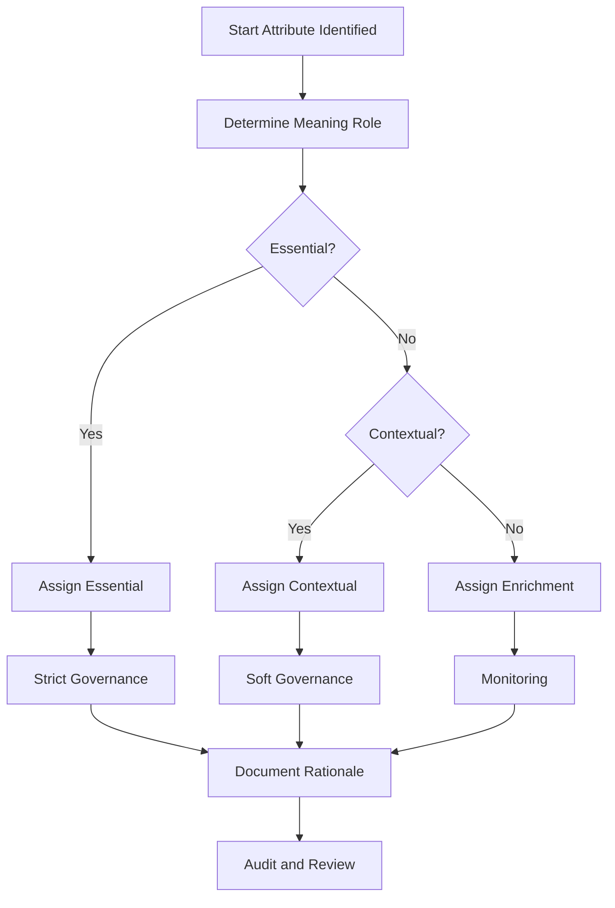

```mermaid
flowchart TD
    A[Start Attribute Identified] --> B[Determine Meaning Role]
    B --> C{Essential?}
    C -->|Yes| D[Assign Essential]
    C -->|No| E{Contextual?}
    E -->|Yes| F[Assign Contextual]
    E -->|No| G[Assign Enrichment]

    D --> H[Strict Governance]
    F --> I[Soft Governance]
    G --> J[Monitoring]

    H --> K[Document Rationale]
    I --> K
    J --> K

    K --> L[Audit and Review]
```
