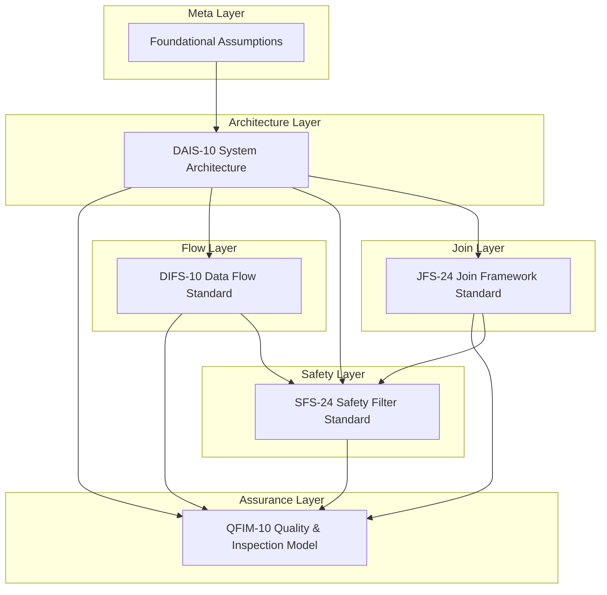
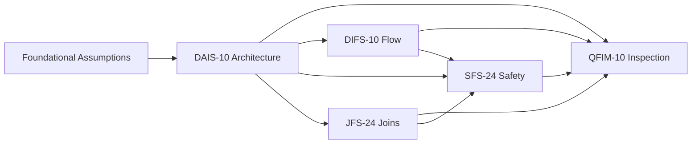
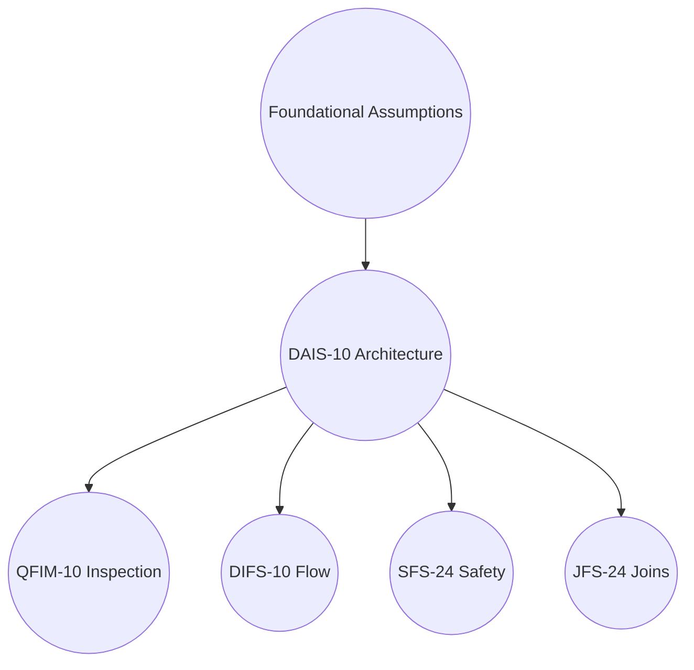
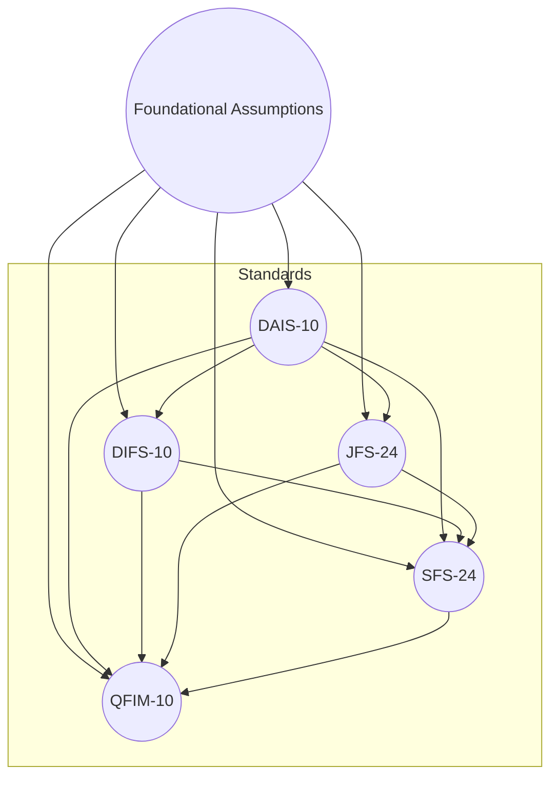

Layered Architecture Diagram (Professional, Clean)
This is the closest to an enterprise architecture visual.



Why this is better:

Uses layered grouping (subgraphs)

Looks like a real enterprise architecture stack

Clean, readable, and publish‑ready

⭐ Option 2 — Mindmap (Executive‑level clarity)
This is excellent for presentations and GitHub READMEs.

```mermaid
mindmap
  root((Standards Universe))
    Foundational Assumptions
      DAIS-10 System Architecture
        QFIM-10 Quality & Inspection
        DIFS-10 Data Flow
        SFS-24 Safety Filters
        JFS-24 Join Framework
Why this is better:

Extremely clean

Shows hierarchy instantly

Perfect for executive summaries
```
⭐ Option 3 — Left‑to‑Right Architecture (More modern, more readable)



Why this is better:

Horizontal layout is easier to read

Looks more like a data pipeline

Great for technical documentation

⭐ Option 4 — Onion Model (Most professional for standards)
This is the style used in ISO, NIST, and TOGAF documentation.



Why this is better:

Circular “core‑to‑outer‑layer” representation

Matches your fractal / infinite‑depth philosophy

Very clean and modern

Option 5 — Standards Universe Map (Most visually impressive)
This is the most “professional” and visually striking.



Why this is better:

Uses circles for standards

Uses subgraph grouping

Looks like a professional standards constellation
