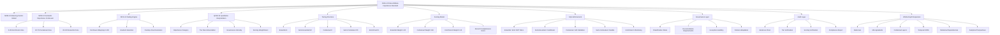

```mermaid
flowchart TD

    %% Core Standard
    A[DAIS-10 Data Attribute Importance Standard]

    %% Foundational Models
    A --> M[MCM-10 Meaning-Centric Model]
    A --> S[SICM-10 Semantic Importance Continuum]
    A --> D[DIFS-10 Fading Engine]
    A --> Q[QFIM-10 Qualitative Interpretation]

    %% Tiering System
    A --> T[Tiering Structure]
    T --> T1[Essential E]
    T --> T2[Semi-Essential EC]
    T --> T3[Contextual C]
    T --> T4[Semi-Contextual CN]
    T --> T5[Enrichment N]

    %% Continuum Flow
    S --> C0[0-39 Enrichment Zone]
    S --> C1[40-79 Contextual Zone]
    S --> C2[80-100 Essential Zone]

    %% Fading Engine
    D --> D1[Continuum Mapping 0-100]
    D --> D2[Gradient Selection]
    D --> D3[Overlap Zone Resolution]

    %% Qualitative Layer
    Q --> Q1[Importance Category]
    Q --> Q2[Tier Recommendation]
    Q --> Q3[Governance Intensity]
    Q --> Q4[Scoring Weight Band]

    %% Scoring System
    A --> SC[Scoring Model]
    SC --> SC1[Essential Weight 1.00]
    SC --> SC2[Contextual Weight 0.60]
    SC --> SC3[Enrichment Weight 0.10]
    SC --> SC4[Record Completeness Score]

    %% Enforcement
    A --> E[SQL Enforcement]
    E --> E1[Essential: Strict NOT NULL]
    E --> E2[Semi-Essential: Conditional]
    E --> E3[Contextual: Soft Validation]
    E --> E4[Semi-Contextual: Flexible]
    E --> E5[Enrichment: Monitoring]

    %% Governance
    A --> G[Governance Layer]
    G --> G1[Classification Rules]
    G --> G2[Documentation Requirements]
    G --> G3[Exception Handling]
    G --> G4[Domain Adaptation]

    %% Audit
    A --> AU[Audit Layer]
    AU --> AU1[Evidence Chain]
    AU --> AU2[Tier Verification]
    AU --> AU3[Scoring Verification]
    AU --> AU4[Compliance Report]

    %% Infinite Depth
    A --> INF[Infinite-Depth Expansion]
    INF --> INF1[Subzones]
    INF --> INF2[Microgradients]
    INF --> INF3[Contextual Layers]
    INF --> INF4[Temporal Shifts]
    INF --> INF5[Relational Dependencies]
    INF --> INF6[Analytical Perspectives]
```
