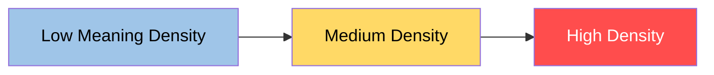

```mermaid
graph LR
    A[Low Meaning Density] --> B[Medium Density] --> C[High Density]

    A:::N
    B:::C
    C:::E

    classDef E fill:#ff4d4d,color:#fff
    classDef C fill:#ffd966,color:#000
    classDef N fill:#9fc5e8,color:#000
```
