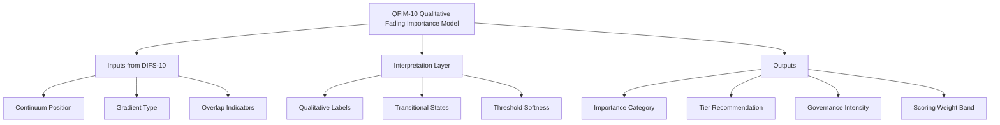

```mermaid
flowchart TD
    A[QFIM-10 Qualitative Fading Importance Model]

    A --> B[Inputs from DIFS-10]
    B --> B1[Continuum Position]
    B --> B2[Gradient Type]
    B --> B3[Overlap Indicators]

    A --> C[Interpretation Layer]
    C --> C1[Qualitative Labels]
    C --> C2[Transitional States]
    C --> C3[Threshold Softness]

    A --> D[Outputs]
    D --> D1[Importance Category]
    D --> D2[Tier Recommendation]
    D --> D3[Governance Intensity]
    D --> D4[Scoring Weight Band]
```
