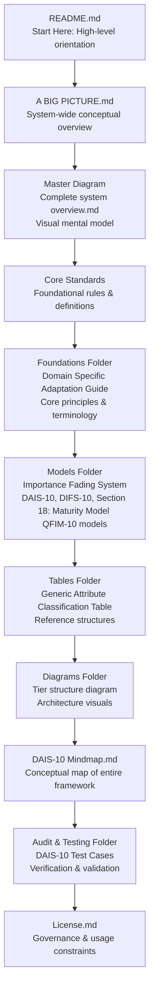

DAIS‑10 — Basic Introduction
DAIS‑10 (Data Attribute Importance Standard) is a qualitative framework for classifying data attributes according to their semantic importance and business utility. It introduces a structured tiering system that distinguishes between attributes that define the meaning of a record, those that provide essential context, and those that offer deeper analytical enrichment.

Unlike traditional data quality approaches that rely on rigid rules or binary validation, DAIS‑10 models attribute importance as a continuum. Importance does not switch abruptly; it fades gradually across overlapping zones. This fading behavior reflects how real‑world datasets behave and allows for more accurate, flexible, and business‑aligned classification.

DAIS‑10 is powered by the Data Importance Fading System (DIFS‑10) and the Qualitative Fading Importance Model (QFIM‑10), which together describe how attribute importance transitions across semantic gradients. These models enable DAIS‑10 to support soft boundaries, nuanced scoring, and infinite depth of analysis.

The standard is designed to be:

Meaning‑centric — classification is based on semantic value, not data type

Domain‑agnostic — applicable to any dataset or industry

Reproducible — consistent across teams and systems

Auditable — transparent rules and verifiable logic

Infinitely extensible — deeper layers emerge as analysis progresses

DAIS‑10 provides the foundation for understanding, governing, and operationalizing attribute importance in modern data environments.
