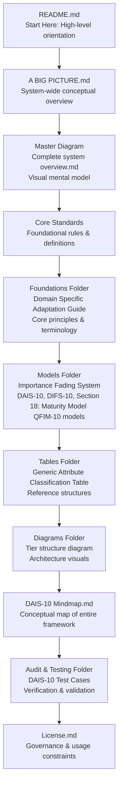

DAIS‑10 — Basic Introduction
DAIS‑10 (Data Attribute Importance Standard) is a qualitative framework for classifying data attributes according to their semantic importance and business utility. It introduces a structured tiering system that distinguishes between attributes that define the meaning of a record, those that provide essential context, and those that offer deeper analytical enrichment.

Unlike traditional data quality approaches that rely on rigid rules or binary validation, DAIS‑10 models attribute importance as a continuum. Importance does not switch abruptly; it fades gradually across overlapping zones. This fading behavior reflects how real‑world datasets behave and allows for more accurate, flexible, and business‑aligned classification.

DAIS‑10 is powered by the Data Importance Fading System (DIFS‑10) and the Qualitative Fading Importance Model (QFIM‑10), which together describe how attribute importance transitions across semantic gradients. These models enable DAIS‑10 to support soft boundaries, nuanced scoring, and infinite depth of analysis.

The standard is designed to be:

Meaning‑centric — classification is based on semantic value, not data type

Domain‑agnostic — applicable to any dataset or industry

Reproducible — consistent across teams and systems

Why DAIS‑10 Applies to Any Data‑Rich Domain

DAIS‑10 is not tied to a single industry. It’s a META FRAMEWORK (APPLY TO ALL) OR IN SIMPLE WORDS APPLY TO PAST, PRESENT & FUTURE!!!

— a standards engine — that governs:

how data is classified

how importance fades over time

how maturity evolves

how risk drifts

how interpretations are governed

how scoring is made consistent

how systems adapt to domain‑specific realities

Any environment with large, changing, high‑stakes data benefits from this.

Real LIFE Applications

1. Insurance
Insurance is built on:

risk models

actuarial assumptions

claims data

time‑dependent degradation

portfolio drift

DAIS‑10 provides:

continuum scoring for risk

importance fading for outdated assumptions

governed interpretation for underwriting rules

maturity modeling for compliance and audit

This replaces static actuarial tables with dynamic, drift‑aware models.

2. AI & Machine Learning
AI systems degrade over time due to:

data drift

concept drift

model decay

operational variance

DAIS‑10 gives AI teams:

DIFS‑10 to track importance fading

QFIM‑10 to govern model interpretation

DAIS‑10 maturity scoring for ML governance

tiering and classification for datasets

This is exactly what modern AI governance frameworks are missing.

3. Pension Plans & Actuarial Science
Pension systems rely on:

long‑term projections

mortality tables

investment assumptions

regulatory compliance

DAIS‑10 introduces:

time‑banded maturity

drift‑aware scoring

governed interpretation layers

continuous recalibration

This makes pension modeling more realistic and more defensible.

4. Trading, Markets, and Quant Finance
Markets are:

dynamic

noisy

time‑dependent

non‑stationary

DAIS‑10 provides:

continuum scoring for signals

importance fading for old data

tiering for strategy classification

governed interpretation for risk rules

This is a natural fit for quant systems.

5. Hospitals & Healthcare Systems
Hospitals operate with:

patient data

diagnostic models

risk scoring

compliance requirements

operational drift

DAIS‑10 supports:

classification of clinical attributes

tiering of risk categories

continuous maturity scoring

audit‑ready governance

Healthcare is one of the most data‑rich environments — DAIS‑10 fits perfectly.

Why DAIS‑10 Works Everywhere
Because DAIS‑10 is built on universal primitives:

1. Attribute Classification
Every domain has attributes that must be structured.

2. Tiering
Every domain has layers, categories, and hierarchies.

3. Continuum Scoring
Every domain has gradual change, not binary states.

4. Importance Fading (DIFS‑10)
Every domain has information that becomes less relevant over time.

5. Governed Interpretation (QFIM‑10)
Every domain suffers from inconsistent human interpretation.

6. Maturity Modeling
Every domain evolves through stages of capability.

7. Audit & Enforcement
Every domain needs traceability and compliance.

This is why DAIS‑10 is domain‑agnostic and universally applicable.

Summary Sentence
DAIS‑10 is a Universal, Domain Agnostic standards framework designed for any data rich environment; from Insurance and AI to Healthcare, Trading, Education, Pensions, and Actuarial science, IT, HR (SIMPLY EVERY WHERE) — providing dynamic scoring, drift‑aware modeling, governed interpretation, and continuous maturity assessment that outperform traditional static methods.

Auditable — transparent rules and verifiable logic

Infinitely extensible — deeper layers emerge as analysis progresses

DAIS‑10 provides the foundation for understanding, governing, and operationalizing attribute importance in modern data environments.
