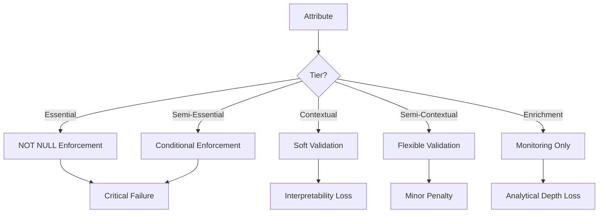

```mermaid
flowchart TD
    A[Attribute] --> B{Tier?}

    B -->|Essential| C[NOT NULL Enforcement]
    B -->|Semi-Essential| D[Conditional Enforcement]
    B -->|Contextual| E[Soft Validation]
    B -->|Semi-Contextual| F[Flexible Validation]
    B -->|Enrichment| G[Monitoring Only]

    C --> H[Critical Failure]
    D --> H
    E --> I[Interpretability Loss]
    F --> J[Minor Penalty]
    G --> K[Analytical Depth Loss]
```
