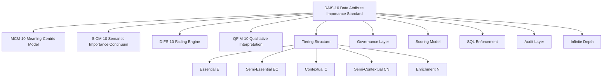
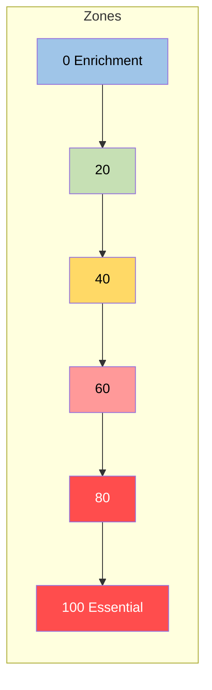
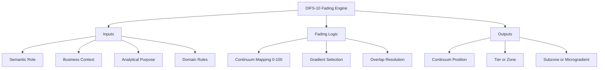
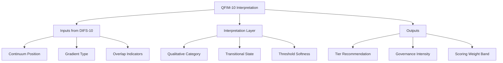
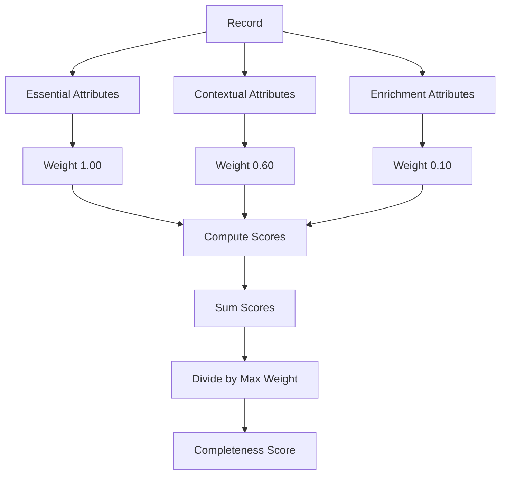
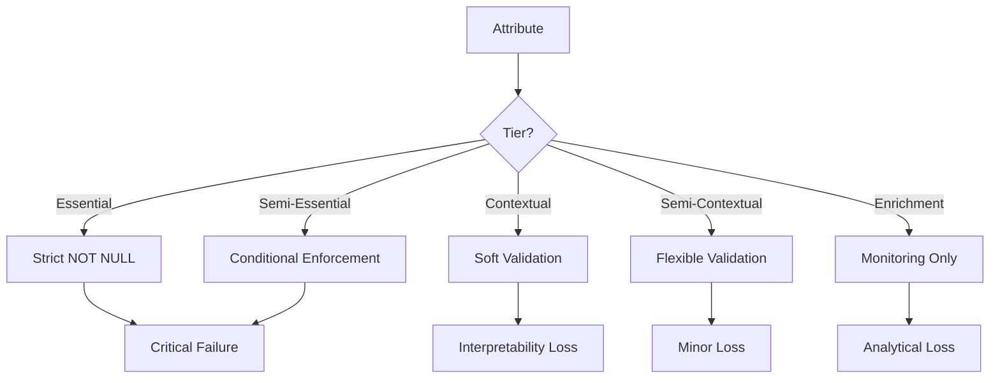
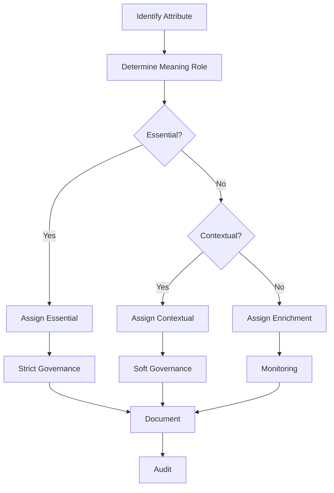
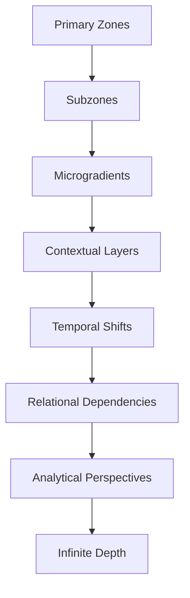

8. Diagram Suite & Visual Standards
DAIS‑10 — Data Attribute Importance Standard
This section defines the complete visual representation framework for DAIS‑10, including all diagrams, their purpose, their structural conventions, and their role in supporting interpretation, governance, and implementation. All diagrams are provided in Mermaid format for compatibility with GitHub, documentation systems, and automated rendering pipelines.

The diagrams in this section serve as the canonical visual reference for DAIS‑10, DIFS‑10, QFIM‑10, SICM‑10, and MCM‑10.

8.1 Purpose of the Diagram Suite
The diagram suite exists to:

Provide a visual representation of the DAIS‑10 standard

Support interpretability, training, and governance

Enable consistent implementation across organizations

Offer a single‑page view of the entire system

Document relationships, flows, and dependencies

Support infinite‑depth expansion through modular diagrams

Each diagram is designed to be:

Domain‑agnostic

Meaning‑centric

Scalable

GitHub‑compatible

Renderable in any Mermaid‑enabled environment

8.2 Diagram Categories
DAIS‑10 diagrams fall into six categories:

Architecture Diagrams

Tiering & Continuum Diagrams

Engine Diagrams (DIFS‑10, QFIM‑10, SICM‑10, MCM‑10)

Scoring & Enforcement Diagrams

Governance & Audit Diagrams

Data Model Diagrams (ERD, Class Diagrams)

Each category is represented in this section.

8.3 Diagram Conventions
All diagrams follow these conventions:

ASCII‑only labels

No HTML tags

No Unicode punctuation

Single‑line node labels

Consistent naming

Zones and tiers color‑coded when supported

Flow direction chosen for clarity (TD, LR)

8.4 Complete Diagram Set
Below is the full suite of diagrams, each with a heading and a GitHub‑safe Mermaid block.

8.4.1 DAIS‑10 Architecture Diagram
markdown

8.4.2 Tier Structure Diagram
markdown

8.4.3 Semantic Continuum Diagram
markdown

8.4.4 DIFS‑10 Fading Engine Diagram
markdown

8.4.5 QFIM‑10 Interpretation Diagram
markdown

8.4.6 Scoring Model Diagram
markdown

8.4.7 SQL Enforcement Diagram
markdown

8.4.8 Governance Flow Diagram
markdown

8.4.9 Infinite‑Depth Expansion Diagram
markdown

8.5 Diagram Governance Rules
To ensure consistency:

All diagrams must use Mermaid syntax

All diagrams must be ASCII‑only

All diagrams must use single‑line labels

All diagrams must be version‑controlled

Updates require governance approval

8.6 Diagram Versioning
Each diagram must include:

Diagram version

DAIS‑10 version

Change log entry

End of Section 8 — Diagram Suite & Visual Standards
