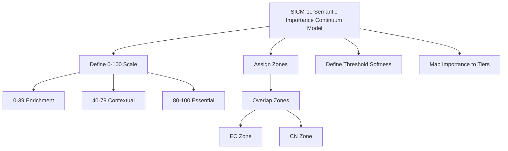

```mermaid
flowchart TD
    A[SICM-10 Semantic Importance Continuum Model]

    A --> B[Define 0-100 Scale]
    A --> C[Assign Zones]
    A --> D[Define Threshold Softness]
    A --> E[Map Importance to Tiers]

    B --> F[0-39 Enrichment]
    B --> G[40-79 Contextual]
    B --> H[80-100 Essential]

    C --> I[Overlap Zones]
    I --> I1[EC Zone]
    I --> I2[CN Zone]
```
