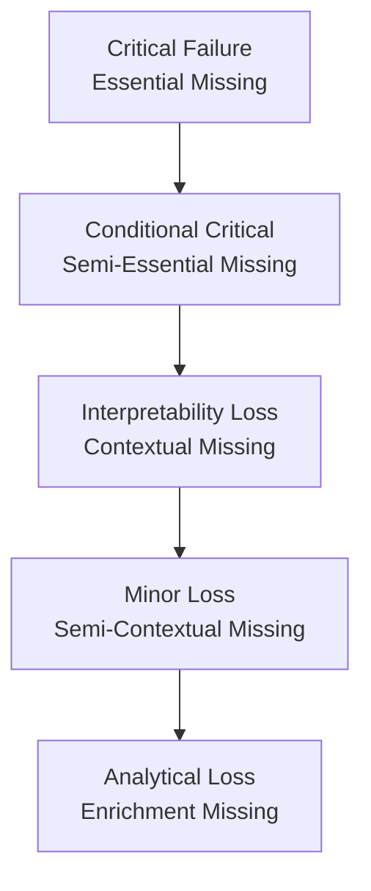

```mermaid
flowchart TD
    F1[Critical Failure\nEssential Missing]
    F2[Conditional Critical\nSemi-Essential Missing]
    F3[Interpretability Loss\nContextual Missing]
    F4[Minor Loss\nSemi-Contextual Missing]
    F5[Analytical Loss\nEnrichment Missing]

    F1 --> F2 --> F3 --> F4 --> F5
```
