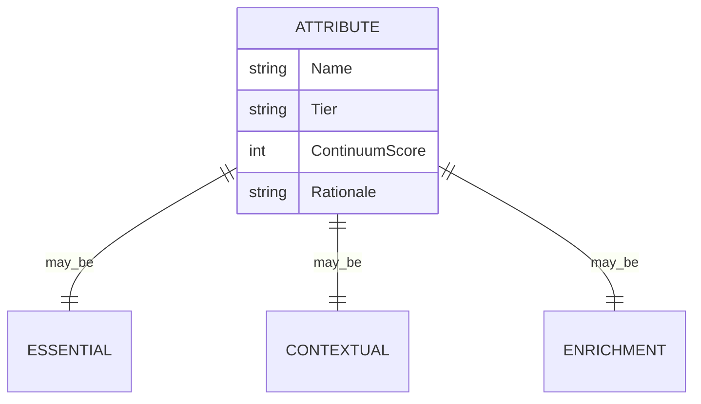

```mermaid
erDiagram
    ATTRIBUTE {
        string Name
        string Tier
        int ContinuumScore
        string Rationale
    }

    ATTRIBUTE ||--|| ESSENTIAL : may_be
    ATTRIBUTE ||--|| CONTEXTUAL : may_be
    ATTRIBUTE ||--|| ENRICHMENT : may_be
```
