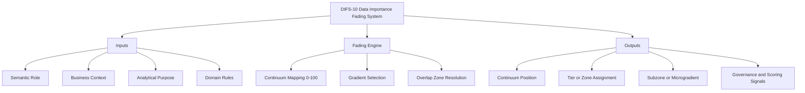

```mermaid
flowchart TD
    A[DIFS-10 Data Importance Fading System]

    A --> B[Inputs]
    B --> B1[Semantic Role]
    B --> B2[Business Context]
    B --> B3[Analytical Purpose]
    B --> B4[Domain Rules]

    A --> C[Fading Engine]
    C --> C1[Continuum Mapping 0-100]
    C --> C2[Gradient Selection]
    C --> C3[Overlap Zone Resolution]

    A --> D[Outputs]
    D --> D1[Continuum Position]
    D --> D2[Tier or Zone Assignment]
    D --> D3[Subzone or Microgradient]
    D --> D4[Governance and Scoring Signals]
```
