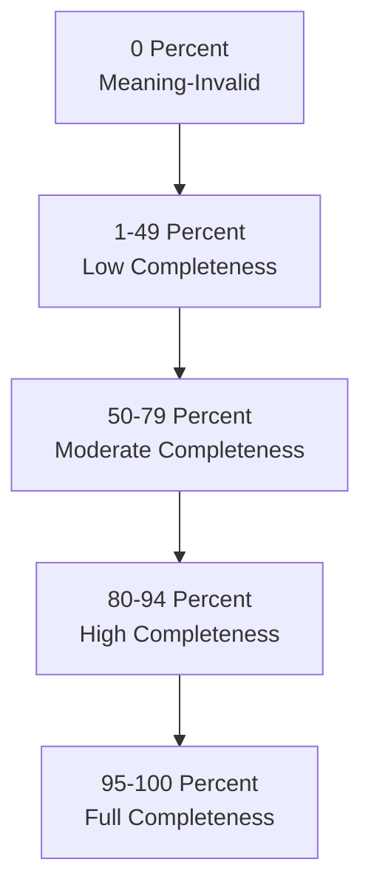

```mermaid
flowchart TD
    A0[0 Percent\nMeaning-Invalid] --> A1[1-49 Percent\nLow Completeness]
    A1 --> A2[50-79 Percent\nModerate Completeness]
    A2 --> A3[80-94 Percent\nHigh Completeness]
    A3 --> A4[95-100 Percent\nFull Completeness]
```
